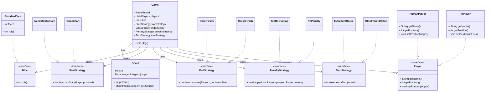

# Class Diagram

```mermaid
classDiagram
    %% ==================== Classes ====================
    class Game {
        - Board board
        - List~Player~ players
        - Dice dice
        - StartStrategy startStrategy
        - EndStrategy endStrategy
        - PenaltyStrategy penaltyStrategy
        - TurnStrategy turnStrategy
        + void play()
    }

    class Board {
        - int size
        - Map~Integer,Integer~ jumps
        + int getSize()
        + Map~Integer,Integer~ getJumps()
    }

    class Player {
        <<interface>>
        + String getName()
        + int getPosition()
        + void setPosition(int pos)
    }

    class HumanPlayer {
        + String getName()
        + int getPosition()
        + void setPosition(int pos)
    }

    class AIPlayer {
        + String getName()
        + int getPosition()
        + void setPosition(int pos)
    }

    class Dice {
        <<interface>>
        + int roll()
    }

    class StandardDice {
        - int faces
        + int roll()
    }

    class StartStrategy {
        <<interface>>
        + boolean canStart(Player p, int roll)
    }

    class NeedsSixToStart
    class DirectStart

    class EndStrategy {
        <<interface>>
        + boolean hasWon(Player p, int boardSize)
    }

    class ExactFinish
    class CrossFinish

    class PenaltyStrategy {
        <<interface>>
        + void apply(List~Player~ players, Player current)
    }

    class KillOnOverlap
    class NoPenalty

    class TurnStrategy {
        <<interface>>
        + boolean extraTurn(int roll)
    }

    class ExtraTurnOnSix
    class StrictRoundRobin


    %% ==================== Relationships ====================

    %% Composition / Aggregation
    Game --> Board : has
    Game --> Dice : uses
    Game --> StartStrategy : uses
    Game --> EndStrategy : uses
    Game --> PenaltyStrategy : uses
    Game --> TurnStrategy : uses
    Game --> Player : manages *

    %% Implementation / Realization
    HumanPlayer ..|> Player
    AIPlayer ..|> Player

    StandardDice ..|> Dice

    NeedsSixToStart ..|> StartStrategy
    DirectStart ..|> StartStrategy

    ExactFinish ..|> EndStrategy
    CrossFinish ..|> EndStrategy

    KillOnOverlap ..|> PenaltyStrategy
    NoPenalty ..|> PenaltyStrategy

    ExtraTurnOnSix ..|> TurnStrategy
    StrictRoundRobin ..|> TurnStrategy

```
